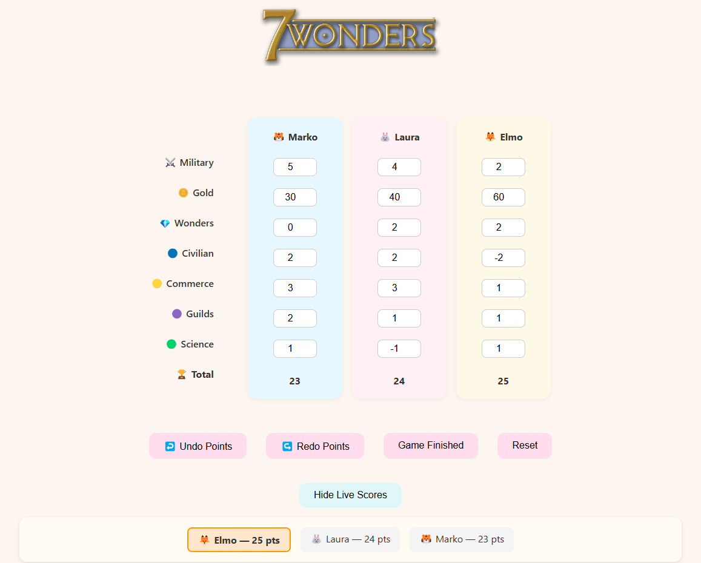

# 7 Wonders Digital Scoreboard

A cozy and simple web app for tracking your scores during a game of **7 Wonders**!  
Built by [Brianda](https://github.com/Brianda88). 💖

✨ **Live site:** [Click here to open](https://brianda88.github.io/7wonders-scoreboard/)

---

## Features
- Random emoji avatars for players
- Easy input for different scoring categories: 🛡️ Military, 🪙 Gold, 💎 Wonders, 🔵 Civilian, 🟡 Commerce, 🟣 Guilds, 🟢 Science
- Undo and Redo actions for points
- Live scoreboard showing who's winning (can be hidden)
- Confetti celebration for the winner!
- Responsive design
- Mobile-friendly

---

## How to Use
1. Choose the number of players
2. Enter player names and pick a cute emoji
3. Track points easily during the game

---

## Points Calculation Logic

- 🛡️ **Military**, 💎 **Wonders**, 🔵 **Civilian**, 🟡 **Commerce**, 🟣 **Guilds**, and 🟢 **Science** points are added directly.
- 🪙 **Gold** points are special:
  - Every **3 coins = 1 point** (rounded down).
  - Example: 
    - 7 coins = 2 points
    - 5 coins = 1 point
    - 2 coins = 0 points

---

## Tech Stack
- HTML5
- CSS3
- JavaScript (Vanilla)

---

## Screenshot

---

## Credits 
Special thanks to Navi (my ChatGPT assistant) for all the help, support and positive energy 😄✨

---

